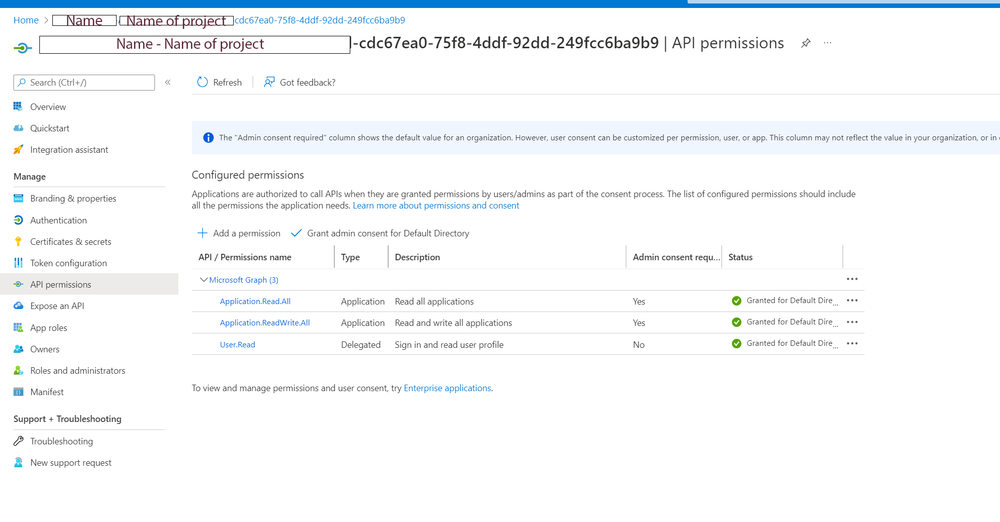

# Netapp CI/CD  compatible terraform module

This module creates the following
- The netapp storage class CSI which can be consumed by your application dynaically i.e it will create the PV (persistant volume) and PVC (persisant volume claimsfor you)
- The netapp volume infrastructure which includes
	- netapp account
	- Azure netapp_pool  (defaults to the minimum of 4tb in size this can coustomised)
	- Trident oscestrator crd
	- A dedicated azue subnet for the netapp CSI network
	- Install the netapp helm chart
	- Seperate credentails for netapp (this module will create an application  role for it i.e a service account)
	- The Netapp backend config

# Vars which you can modify
```
variable  "netapp_address_prefixes" {

type  =  list(string)

default  =  ["10.1.1.0/24"]

}

variable  "namespace" {

type  =  string

default  =  "netapp"

}

  

variable  "allow_volume_exspansion" {

type  =  bool

default  =  true

description  =  "increase volume size for pvs"

}

  

variable  "servicelevel" {

type  =  string

default  =  "Premium"

}

  

variable  "storageclass" { }

  

variable  "persistence_size" { }

variable  "max_persistence_size" { }

variable  "debugval" {

type  =  bool

default  =  "true"

}

  

variable  "netapp_enabled" {

type  =  bool

default  =  "false"

}

  

variable  "virtual_network_name" {

type  =  string

}

variable  "netapp_subnetname" {

type  =  string

}


variable  "resource_group_name" {

type  =  string

}

variable  "location" {

type  =  string

}
```

# Outputs from this module

```
output  "nettapp_sp_password" {

value  =  azuread_service_principal_password.test.value

}

  

output  "netapp_sp_object_id" {

value  =  azuread_service_principal.test.object_id

}

  

output  "netapp_sp_app_id" {

value  =  azuread_application.test.application_id

}

  

output  "netapp_settings" {

value  =  data.template_file.netapp_backend_config.rendered

}
```

# Prereqs
This module assumes that you have an contribtor accouunt which can do the following
- you have the following providers within your project 
	- 	azurerm
	- helm
	- kubectl
	
-  Configure Graph API with the following permissions on the application role which utilises azure Devops
	- Application.Read.All
	- Application.ReadWrite.All
	- User.Read (I think this is an optional requirement however, I used this permission to make this module work)

The link explains this in more detail
-	https://docs.snowsoftware.com/snow-integration-manager/en/UUID-ec73b339-efd1-0a20-42c1-c8e4c431a08f.html


The below is an example of what to see


**if you are using a different CI/CD solutions
you may need to make a service princiapl with contributor or Admin permissions with permissions similar to the ones above in order to create the new service accounts for netapp to use**

Please note that the permissions above are hobbyist permissions and in production enviroments with P1/P2 subcriptions more aggrevise permissions should be used as per least privilege, if you are unsure what permissions are suitable please check with your Security DevOps or DevSecOps teams